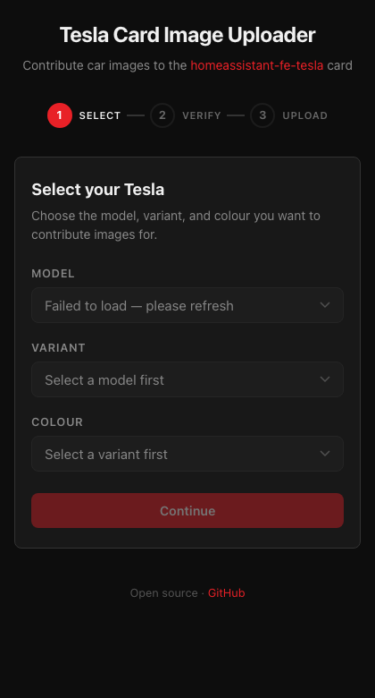
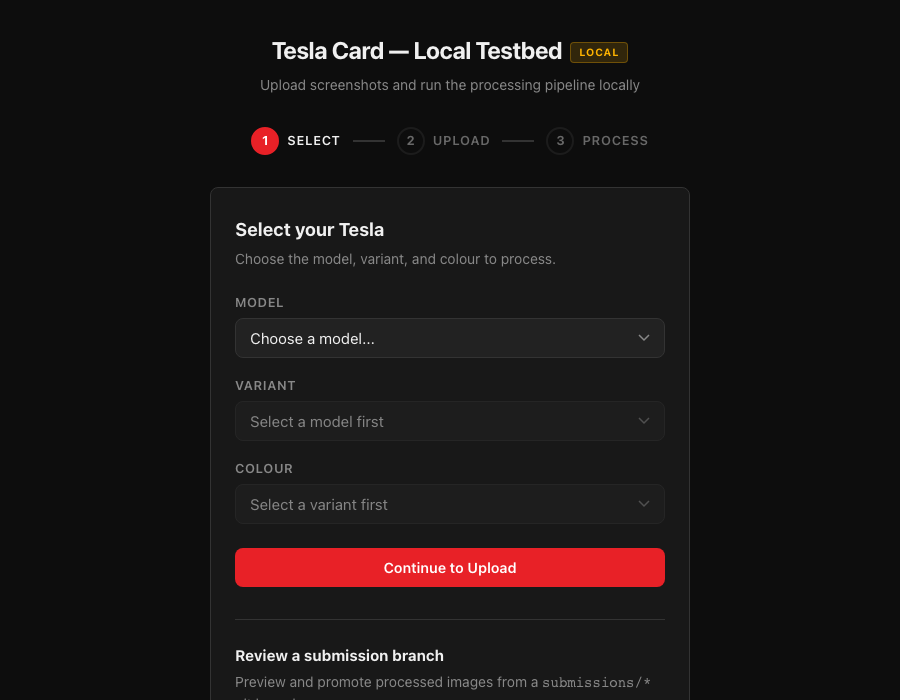

# Tesla Card Image Uploader

Community image contribution pipeline for the [homeassistant-fe-tesla](https://github.com/ds2000/homeassistant-fe-tesla) card.

If you find the card useful: 

Contributors submit car images via a GitHub Pages web app. Submissions are automatically validated, aligned against reference images using OpenCV, and opened as PRs for review before being merged into the image library.

| Submission App | Local Testbed |
|---------------|--------------|
|  |  |

## How It Works

1. **Select** your Tesla model, variant, and colour
2. **Verify** your email address
3. **Upload** all required screenshots (15 PNGs -- 9 offcharge + 6 on-charge)
4. Images are automatically aligned, processed, and submitted as a PR

## Links

- **Submit images:** https://ds2000.github.io/homeassistant-fe-tesla-image-uploader
- **Tesla card:** https://github.com/ds2000/homeassistant-fe-tesla

## Contributors

Thanks to everyone who has submitted images for the card!

<!-- Contributors are added here when submission PRs are merged. -->
<!-- Format: | [@username](https://github.com/username) | Model 3 2017-2023 Red Multi-Coat | -->

| Contributor | Submission |
|-------------|------------|
<!-- END_CONTRIBUTORS -->
